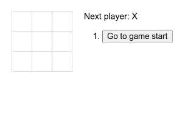

<h1 align="center">
  
  <h3 align="center">
    Tutorial React - Jogo da velha
  </h3>
</h1>

Este é um tutorial introdutório realizado pela comunidade do React. Tem como objetivo a criação de um jogo da velha para aplicar fundamentos e téncnicas essenciais para iniciar neste framework. 

    

## 🚀 Tecnologias

- ⚡ React — A web framework for JavaScript 

## ✋🏻 Pré-requisitos

- [Node.js](https://nodejs.org/en/)

## 🔥 Instalação e execução

1. Faça um clone desse repositório 
`git clone https://github.com/christopherbertonzin/tutorial-react.git`;
2. Entre na pasta `cd tutorial-react/`;
3. Rode `npm install` para instalar as dependências;
4. Rode `npm start` para iniciar o servidor.
5. Acesse `http://localhost:3000/`

## ⚡️ Onde aprender

- Acesse o site do React e navegue até o menu [tutorial](https://pt-br.reactjs.org/tutorial/tutorial.html)

## 📝 Licença

Esse projeto está sob a licença MIT. Veja o arquivo [LICENSE](LICENSE.md) para mais detalhes.

---
